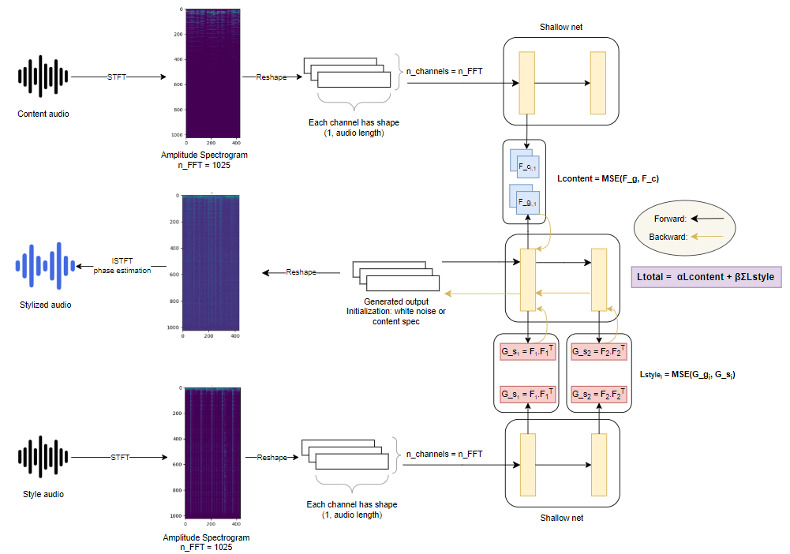

# IMT-ProjectDL-Neural-Style-Transfer
This is the github repository for the Deep Learning course project on Neural Style Transfer.  
Contributors:
- DUONG Hoang
- LUC Tan Tho

The brief description for each file is shown in the table below:

<table>
<tr><td>

| File name | Description |
|-----------|-------------|
|image_style_transfer.ipynb|tutorial of Image Neural Style Transfer|
|Vggish|contain notebook of Vggish based approach|
|pretrained_cnn|contain notebook of CNN14_16k based approach|
|shallow_net|contain notebook of Shallow-net based approach|
|data|audio/image input data|
|output|output audios from Shallow net|
|DL_final.pdf|presentation slides of the topic|

</td></tr> </table>

## 1. Neural Style Transfer
The objective of Neural Style Transfer is to generate artistic image by transferring the style from one image (style image) onto another (content image).

The original work for Image Style Transfer was introduced by [Leon A. Gatys et al.](https://www.cv-foundation.org/openaccess/content_cvpr_2016/papers/Gatys_Image_Style_Transfer_CVPR_2016_paper.pdf) and its implementation is given in [this tutorial.](https://pytorch.org/tutorials/advanced/neural_style_tutorial.html)

## 2. Audio Style Transfer
### 2.1. Introduction
The idea of Neural Style Transfer is applide on audio application. More precisely, we study the capability of instrument stylization using the same architecture (i.e. CNN). The process is illustrated by the figure below (we can replace **Shallow net** by other models).



In this project, we have considered three different neural style transfer schemes for audio application:
- Vggish: [paper](https://arxiv.org/pdf/1609.09430.pdf), [github]()
- CNN14_16k: [paper](https://arxiv.org/pdf/1912.10211.pdf), [github](https://github.com/qiuqiangkong/audioset_tagging_cnn)
- Shallow net: [paper](https://hal.science/hal-01626389/document)

More information can be found in our presentation slides.

### 2.2. Result
Among three candidates, Shallow net (with 1D-kernel CNN) outperforms the others. Furthermore, this approach does not need pretrained weights and it executes rapidly thanks to its shallow architecture. Some results can be found in [this folder](output).

The pretrained-model based approaches using Vggish and CNN14_16k do not work on audio stylizing. The problem may be caused by the 2D kernel which is not suitable to featurize and rescontruct the content. The results show that most of content has disappeared.

### 2.3. Perspective
Our results confirm the potential of this audio application. However, the output is usually noisy. In practice, some advanced Deep Learning methods has been used for this task, such as GAN or Autoencoder.

## 3. How to run ?
### 3.1. Requirements
```
pip install -r requirements.txt
```

### 3.2. Vggish
Run notebook **Vggish_audio.ipynb** stored in **Vggish** folder.

### 3.3. CNN14_16k
Access [this link](https://zenodo.org/records/3987831) and download **Cnn14_16k_mAP=0.438.pth** or other pretrained model that you want, then store it in **pretrained_cnn** folder. Finally, run notebook **CNN_audio.ipynb**.

### 3.4. Shallow net
Run notebook **Shallow_net_audio.ipynb** stored in **shallow_net** folder.

Furthermore, you can change the layer(s) where you wish to extract content/style in **Model definition** section. The notebooks can be run locally or online by using Colab.